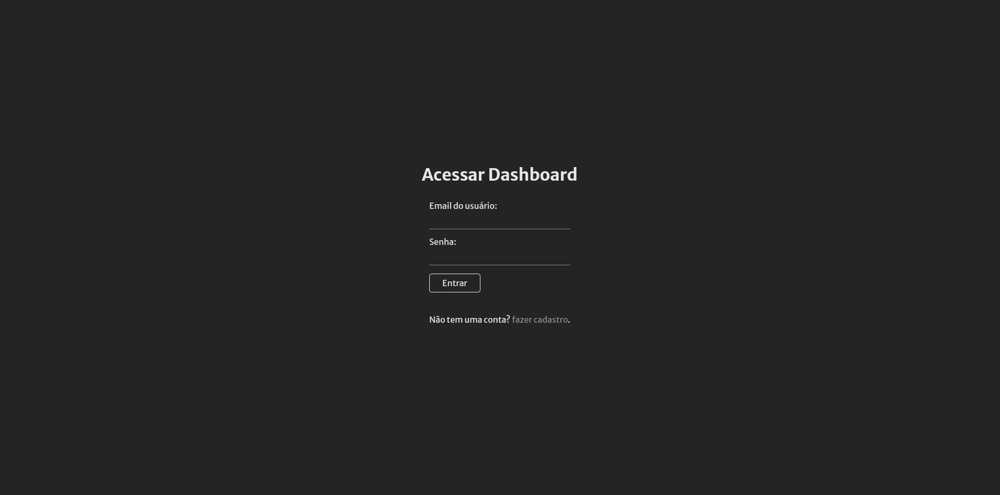
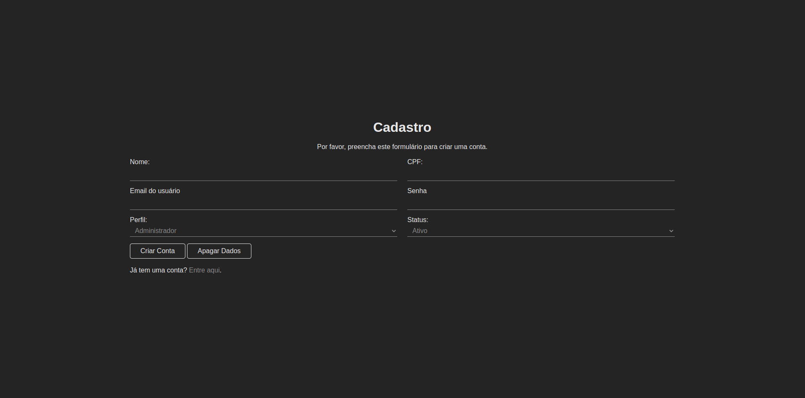
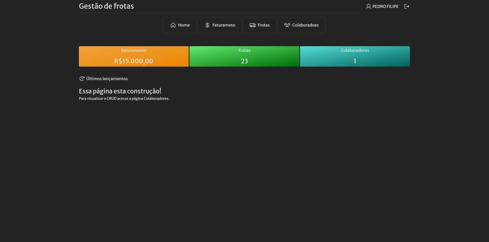
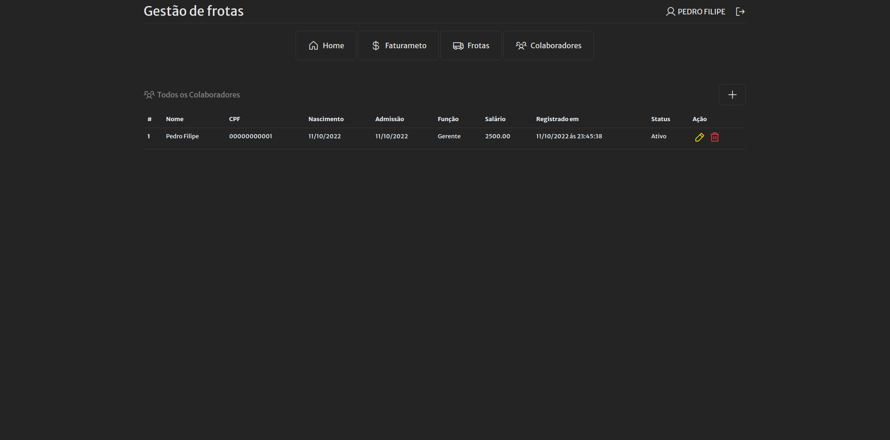
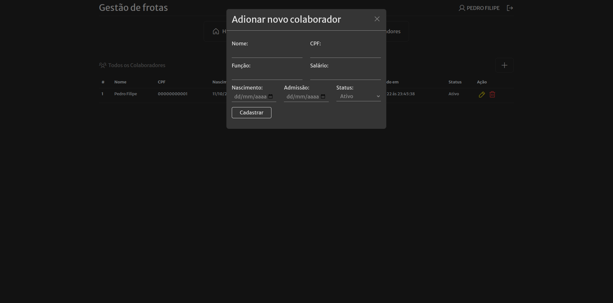
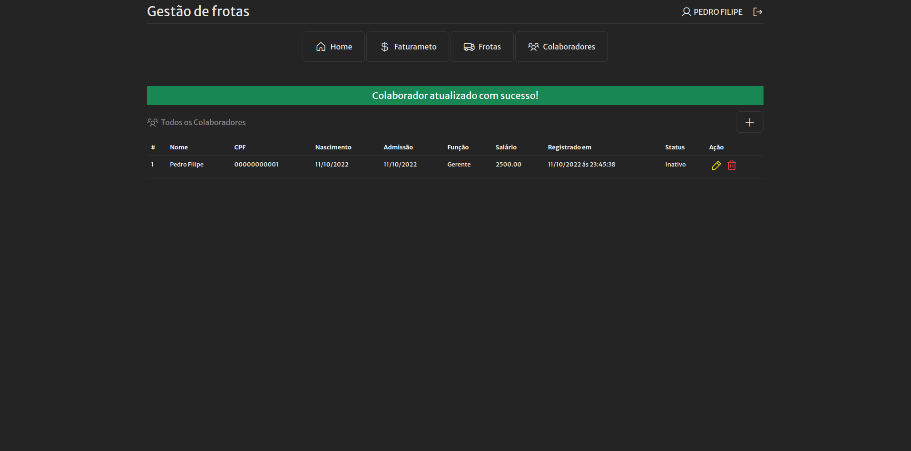
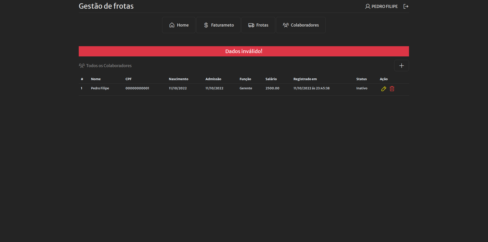

# Projeto final do curso programador Back-end PHP

***Projeto para gestão de frotas e seu faturamento***

  🚀 <a href="http://gestaofrota.epizy.com/" target="blank">Deploy: http://gestaofrota.epizy.com/</a>

    
Tela de Login

    

    
Registro de usuário

    

    
Dashboard

    

    
Página de Colaborador

    

    
Registro de Colaborador

    

    
Retorno de sucesso

    

    
Retorno de Erro

    

Nesta entrega, é uma pequena parte de um projeto maior, em que será criado um sistema completo de gestão de frotas e seu faturamento.

    <h5>O que foi feito no projeto:</h5>
    <ol>
        <li><strong>Tela de login</strong> com autenticação de usuário, validação e niveis de acesso.</li>
        <li><strong>Telas de cadastro</strong> de usuários e colaboradores.</li>
        <li><strong>Função de edição</strong> dos dados dos colaboradores.</li>
        <li><strong>Função de exclusão</strong> de dados do banco de dados.</li>
        <li><strong>Segurança de dados</strong> com PDO.</li>
        <li><strong>Paradigma de orientação a objetos.</strong></li>
        <li><strong>Hospedagem</strong> feita na Infinity Free.</li>
    </ol>

    <h5>Próximos passos:</h5>
    <ol>
        <li>Inclusão das entidades restantes: Frotas, faturamento e Despesas.</li>
        <li>Composer: utilização de namespaces, pacotes que auxiliarão no desenvolvimento.</li>
        <li>Adaptação para ser utilizado em vários dispositivos.</li>
        <li>Buscando novas feautures...</li>
    </ol>

OBS.: Provável que o projeto completo será integrado a um site, ou entregue em sua forma principal para solucionar problemas reais.

